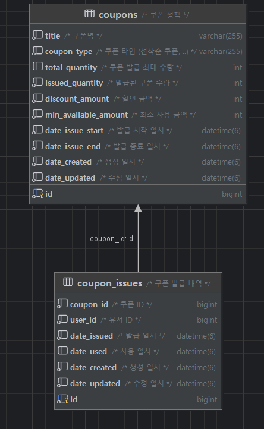

# 선착순 쿠폰 발급 시스템

- 한정된 수량의 쿠폰을 먼저 신청한 유저에게 제공한다.
- 기간 내에 발급이 가능하다.
- 유저당 한 개의 쿠폰 발급만 가능하다.
- 정확한 발급 수량을 제어한다.
- Mysql,redis 기반 쿠폰 발급 기능을 개발한다.
- Locust 를 통해 성능 테스트를 진행한다.

## 기간
- 2024.11.27 ~ 2024.12.9

## 인원
- 개인

## 기술 스택 및 도구
- Java 17
- Spring Boot 3
- My Sql
- JPA
- Query Dsl
- Redis
- H2
- IntelliJ
- Docker (docker desktop)
- Prometheus & Grafana
- Locust
- AWS

## ERD


##  API 
- /v1/issue 
  - 동기식 쿠폰 발급
- /v1/issue-async 
  - redis 분산락 쿠폰 발급
- /v2/issue-async 
  - redis script 를 사용한 쿠폰 발급

## 기능 구현
- 쿠폰 발급 
  - 쿠폰 발급 기간 검증
  - 쿠폰 발급 수량 검증 
    - 쿠폰 전체 발급 수량
    - 중복 발급 요청 검증
  - 쿠폰 발급 수량 증가
  - 쿠폰 발급 기록 저장 
    - 쿠폰 ID
    - 유저 ID

## 패키지 구조
- coupon-api 
  - 쿠폰에 대한 api 서버
  - 유저의 요청을 처리한다
- coupon-consumer
  - 쿠폰을 비동기적 구조로 발급하는데, 발급에 대한 요청을 읽어 실제 쿠폰을 발급하는 서버
- coupon-core
  - api, consumer 에서 공통적으로 사용하는 기능을 담아 중복되는 코드를 줄인다. <br>
```bash
  C:\PROJECT\COUPON
|   .gitattributes
|   .gitignore
|   build.gradle.kts
|   docker-compose.yml
|   gradlew
|   gradlew.bat
|   READ.md
|   settings.gradle.kts
|
+---.gradle
|   |   file-system.probe
|   |
|   +---8.11.1
|   |   |   gc.properties
|   |   |
|   |   +---checksums
|   |   |       checksums.lock
|   |   |       md5-checksums.bin
|   |   |       sha1-checksums.bin
|   |   |
|   |   +---executionHistory
|   |   |       executionHistory.bin
|   |   |       executionHistory.lock
|   |   |
|   |   +---expanded
|   |   +---fileChanges
|   |   |       last-build.bin
|   |   |
|   |   +---fileHashes
|   |   |       fileHashes.bin
|   |   |       fileHashes.lock
|   |   |       resourceHashesCache.bin
|   |   |
|   |   \---vcsMetadata
|   +---buildOutputCleanup
|   |       buildOutputCleanup.lock
|   |       cache.properties
|   |       outputFiles.bin
|   |
|   \---vcs-1
|           gc.properties
|
+---.idea
|   |   .gitignore
|   |   compiler.xml
|   |   dataSources.local.xml
|   |   dataSources.xml
|   |   google-java-format.xml
|   |   gradle.xml
|   |   jarRepositories.xml
|   |   jpa.xml
|   |   misc.xml
|   |   modules.xml
|   |   uiDesigner.xml
|   |   vcs.xml
|   |   workspace.xml
|   |
|   +---dataSources
|   |   |   421c680c-a178-419a-9777-73d82df69112.xml
|   |   |   90b24837-ee20-4464-88e1-0174dfd5ec01.xml
|   |   |   f07d41ab-9ca5-4d37-8fb6-1a4de289af56.xml
|   |   |
|   |   +---421c680c-a178-419a-9777-73d82df69112
|   |   |   \---storage_v2
|   |   |       \---_src_
|   |   |           \---schema
|   |   |                   coupon.JthCrw.meta
|   |   |
|   |   \---90b24837-ee20-4464-88e1-0174dfd5ec01
|   |       \---storage_v2
|   |           \---_src_
|   |               \---schema
|   |                       coupon.JthCrw.meta
|   |
|   \---modules
|       +---coupon-api
|       +---coupon-consumer
|       \---coupon-core
|               coupon.coupon-core.main.iml
|
+---build
|   |   resolvedMainClassName
|   |
|   +---libs
|   |       coupon-0.0.1-SNAPSHOT-plain.jar
|   |
|   +---reports
|   |   \---problems
|   |           problems-report.html
|   |
|   \---tmp
|       \---jar
|               MANIFEST.MF
|
+---coupon-api
|   |   .gitignore
|   |   build.gradle.kts
|   |
|   +---build
|   |   |   resolvedMainClassName
|   |   |
|   |   +---classes
|   |   |   \---java
|   |   |       +---main
|   |   |       |   \---com
|   |   |       |       \---example
|   |   |       |           \---couponapi
|   |   |       |               |   CouponApiApplication.class
|   |   |       |               |
|   |   |       |               +---controller
|   |   |       |               |   |   CouponControllerAdvice.class
|   |   |       |               |   |   CouponIssueController.class
|   |   |       |               |   |   HelloController.class
|   |   |       |               |   |
|   |   |       |               |   \---dto
|   |   |       |               |           CouponIssueRequestDto.class
|   |   |       |               |           CouponIssueResponseDto.class
|   |   |       |               |
|   |   |       |               \---service
|   |   |       |                       CouponIssueRequestService.class
|   |   |       |
|   |   |       \---test
|   |   |           \---com
|   |   |               \---example
|   |   |                   \---couponapi
|   |   |                           CouponApiApplicationTests.class
|   |   |
|   |   +---libs
|   |   |       coupon-api-plain.jar
|   |   |       coupon-api.jar
|   |   |
|   |   +---reports
|   |   |   \---tests
|   |   |       \---test
|   |   |           |   index.html
|   |   |           |
|   |   |           +---classes
|   |   |           |       com.example.couponapi.CouponApiApplicationTests.html
|   |   |           |
|   |   |           +---css
|   |   |           |       base-style.css
|   |   |           |       style.css
|   |   |           |
|   |   |           +---js
|   |   |           |       report.js
|   |   |           |
|   |   |           \---packages
|   |   |                   com.example.couponapi.html
|   |   |
|   |   +---resources
|   |   |   \---main
|   |   |           application-api.yml
|   |   |           application-api.yml.file
|   |   |
|   |   +---test-results
|   |   |   \---test
|   |   |       |   TEST-com.example.couponapi.CouponApiApplicationTests.xml
|   |   |       |
|   |   |       \---binary
|   |   |               output.bin
|   |   |               output.bin.idx
|   |   |               results.bin
|   |   |
|   |   \---tmp
|   |       +---bootJar
|   |       |       MANIFEST.MF
|   |       |
|   |       +---compileJava
|   |       |   |   previous-compilation-data.bin
|   |       |   |
|   |       |   \---compileTransaction
|   |       |       \---stash-dir
|   |       |               CouponApiApplication.class.uniqueId2
|   |       |               CouponIssueController.class.uniqueId1
|   |       |               CouponIssueRequestService.class.uniqueId0
|   |       |
|   |       +---compileTestJava
|   |       |   |   previous-compilation-data.bin
|   |       |   |
|   |       |   \---compileTransaction
|   |       |       \---stash-dir
|   |       |               CouponApiApplicationTests.class.uniqueId0
|   |       |
|   |       \---jar
|   |               MANIFEST.MF
|   |
|   \---src
|       +---main
|       |   +---java
|       |   |   \---com
|       |   |       \---example
|       |   |           \---couponapi
|       |   |               |   CouponApiApplication.java
|       |   |               |
|       |   |               +---controller
|       |   |               |   |   CouponControllerAdvice.java
|       |   |               |   |   CouponIssueController.java
|       |   |               |   |   HelloController.java
|       |   |               |   |
|       |   |               |   \---dto
|       |   |               |           CouponIssueRequestDto.java
|       |   |               |           CouponIssueResponseDto.java
|       |   |               |
|       |   |               \---service
|       |   |                       CouponIssueRequestService.java
|       |   |
|       |   \---resources
|       |           application-api.yml
|       |           application-api.yml.file
|       |
|       \---test
|           \---java
|               \---com
|                   \---example
|                       \---couponapi
|                               CouponApiApplicationTests.java
|
+---coupon-consumer
|   |   .gitignore
|   |   build.gradle.kts
|   |
|   +---build
|   |   |   resolvedMainClassName
|   |   |
|   |   +---classes
|   |   |   \---java
|   |   |       +---main
|   |   |       |   \---com
|   |   |       |       \---example
|   |   |       |           \---couponconsumer
|   |   |       |               |   CouponConsumerApplication.class
|   |   |       |               |
|   |   |       |               \---component
|   |   |       |                       CouponIssueListener.class
|   |   |       |
|   |   |       \---test
|   |   |           \---com
|   |   |               \---example
|   |   |                   \---couponconsumer
|   |   |                       |   CouponConsumerApplicationTests.class
|   |   |                       |   TestConfig.class
|   |   |                       |
|   |   |                       \---component
|   |   |                               CouponIssueListenerTest.class
|   |   |
|   |   +---libs
|   |   |       coupon-consumer-plain.jar
|   |   |       coupon-consumer.jar
|   |   |
|   |   +---reports
|   |   |   \---tests
|   |   |       \---test
|   |   |           |   index.html
|   |   |           |
|   |   |           +---classes
|   |   |           |       com.example.couponconsumer.component.CouponIssueListenerTest.html
|   |   |           |
|   |   |           +---css
|   |   |           |       base-style.css
|   |   |           |       style.css
|   |   |           |
|   |   |           +---js
|   |   |           |       report.js
|   |   |           |
|   |   |           \---packages
|   |   |                   com.example.couponconsumer.component.html
|   |   |
|   |   +---resources
|   |   |   \---main
|   |   |           application-consumer.yml
|   |   |           application-consumer.yml.file
|   |   |
|   |   +---test-results
|   |   |   \---test
|   |   |       |   TEST-com.example.couponconsumer.component.CouponIssueListenerTest.xml
|   |   |       |
|   |   |       \---binary
|   |   |               output.bin
|   |   |               output.bin.idx
|   |   |               results.bin
|   |   |
|   |   \---tmp
|   |       +---bootJar
|   |       |       MANIFEST.MF
|   |       |
|   |       +---compileJava
|   |       |       previous-compilation-data.bin
|   |       |
|   |       +---compileTestJava
|   |       |   |   previous-compilation-data.bin
|   |       |   |
|   |       |   \---compileTransaction
|   |       |       \---stash-dir
|   |       |               CouponIssueListenerTest.class.uniqueId0
|   |       |
|   |       \---jar
|   |               MANIFEST.MF
|   |
|   \---src
|       +---main
|       |   +---java
|       |   |   \---com
|       |   |       \---example
|       |   |           \---couponconsumer
|       |   |               |   CouponConsumerApplication.java
|       |   |               |
|       |   |               \---component
|       |   |                       CouponIssueListener.java
|       |   |
|       |   \---resources
|       |           application-consumer.yml
|       |           application-consumer.yml.file
|       |
|       \---test
|           \---java
|               \---com
|                   \---example
|                       \---couponconsumer
|                           |   CouponConsumerApplicationTests.java
|                           |   TestConfig.java
|                           |
|                           \---component
|                                   CouponIssueListenerTest.java
|
+---coupon-core
|   |   .gitignore
|   |   build.gradle.kts
|   |
|   +---build
|   |   |   resolvedMainClassName
|   |   |
|   |   +---classes
|   |   |   \---java
|   |   |       +---main
|   |   |       |   \---com
|   |   |       |       \---example
|   |   |       |           \---couponcore
|   |   |       |               |   CouponCoreConfiguration.class
|   |   |       |               |
|   |   |       |               +---component
|   |   |       |               |       CouponEventListener.class
|   |   |       |               |       DistributeLockExecutor.class
|   |   |       |               |
|   |   |       |               +---configuration
|   |   |       |               |       CacheConfiguration.class
|   |   |       |               |       LocalCacheConfigration.class
|   |   |       |               |       QueryDslConfiguration.class
|   |   |       |               |       RedisConfiguration.class
|   |   |       |               |
|   |   |       |               +---exception
|   |   |       |               |       CouponIssueException.class
|   |   |       |               |       ErrorCode.class
|   |   |       |               |
|   |   |       |               +---model
|   |   |       |               |   |   BaseTimeEntity.class
|   |   |       |               |   |   Coupon$CouponBuilder.class
|   |   |       |               |   |   Coupon.class
|   |   |       |               |   |   CouponIssue$CouponIssueBuilder.class
|   |   |       |               |   |   CouponIssue.class
|   |   |       |               |   |   CouponType.class
|   |   |       |               |   |   QBaseTimeEntity.class
|   |   |       |               |   |   QCoupon.class
|   |   |       |               |   |   QCouponIssue.class
|   |   |       |               |   |
|   |   |       |               |   \---event
|   |   |       |               |           CouponIssueCompleteEvent.class
|   |   |       |               |
|   |   |       |               +---repository
|   |   |       |               |   +---mysql
|   |   |       |               |   |       CouponIssueJpaRepository.class
|   |   |       |               |   |       CouponIssueRepository.class
|   |   |       |               |   |       CouponJpaRepository.class
|   |   |       |               |   |
|   |   |       |               |   \---redis
|   |   |       |               |       |   CouponIssueRequestCode.class
|   |   |       |               |       |   RedisRepository.class
|   |   |       |               |       |
|   |   |       |               |       \---dto
|   |   |       |               |               CouponIssueRequest.class
|   |   |       |               |               CouponRedisEntity.class
|   |   |       |               |
|   |   |       |               +---service
|   |   |       |               |       AsyncCouponIssueServiceV1.class
|   |   |       |               |       AsyncCouponIssueServiceV2.class
|   |   |       |               |       CouponCacheService.class
|   |   |       |               |       CouponIssueRedisService.class
|   |   |       |               |       CouponIssueService.class
|   |   |       |               |
|   |   |       |               \---util
|   |   |       |                       CouponRedisUtil.class
|   |   |       |
|   |   |       \---test
|   |   |           \---com
|   |   |               \---example
|   |   |                   \---couponcore
|   |   |                       |   TestConfig.class
|   |   |                       |
|   |   |                       +---model
|   |   |                       |       CouponTest.class
|   |   |                       |
|   |   |                       \---service
|   |   |                               AsyncCouponIssueServiceV1Test.class
|   |   |                               AsyncCouponIssueServiceV2Test.class
|   |   |                               CouponIssueRedisServiceTest.class
|   |   |                               CouponIssueServiceTest.class
|   |   |
|   |   +---generated
|   |   |   \---sources
|   |   |       \---annotationProcessor
|   |   |           \---java
|   |   |               \---main
|   |   |                   \---com
|   |   |                       \---example
|   |   |                           \---couponcore
|   |   |                               \---model
|   |   |                                       QBaseTimeEntity.java
|   |   |                                       QCoupon.java
|   |   |                                       QCouponIssue.java
|   |   |
|   |   +---libs
|   |   |       coupon-core-plain.jar
|   |   |
|   |   +---reports
|   |   |   \---tests
|   |   |       \---test
|   |   |           |   index.html
|   |   |           |
|   |   |           +---classes
|   |   |           |       com.example.couponcore.model.CouponTest.html
|   |   |           |
|   |   |           +---css
|   |   |           |       base-style.css
|   |   |           |       style.css
|   |   |           |
|   |   |           +---js
|   |   |           |       report.js
|   |   |           |
|   |   |           \---packages
|   |   |                   com.example.couponcore.model.html
|   |   |
|   |   +---resources
|   |   |   \---main
|   |   |       |   application-core.yml
|   |   |       |   application-core.yml.file
|   |   |       |
|   |   |       \---sql
|   |   |               schema.sql
|   |   |
|   |   +---test-results
|   |   |   \---test
|   |   |       |   TEST-com.example.couponcore.model.CouponTest.xml
|   |   |       |
|   |   |       \---binary
|   |   |               output.bin
|   |   |               output.bin.idx
|   |   |               results.bin
|   |   |
|   |   \---tmp
|   |       +---compileJava
|   |       |   |   previous-compilation-data.bin
|   |       |   |
|   |       |   \---compileTransaction
|   |       |       \---stash-dir
|   |       |               CacheConfiguration.class.uniqueId0
|   |       |
|   |       +---compileTestJava
|   |       |   |   previous-compilation-data.bin
|   |       |   |
|   |       |   \---compileTransaction
|   |       |       \---stash-dir
|   |       |               AsyncCouponIssueServiceV1Test.class.uniqueId2
|   |       |               AsyncCouponIssueServiceV2Test.class.uniqueId4
|   |       |               CouponIssueRedisServiceTest.class.uniqueId1
|   |       |               CouponIssueServiceTest.class.uniqueId0
|   |       |               CouponTest.class.uniqueId3
|   |       |
|   |       \---jar
|   |               MANIFEST.MF
|   |
|   \---src
|       +---main
|       |   +---java
|       |   |   \---com
|       |   |       \---example
|       |   |           \---couponcore
|       |   |               |   CouponCoreConfiguration.java
|       |   |               |
|       |   |               +---component
|       |   |               |       CouponEventListener.java
|       |   |               |       DistributeLockExecutor.java
|       |   |               |
|       |   |               +---configuration
|       |   |               |       CacheConfiguration.java
|       |   |               |       LocalCacheConfigration.java
|       |   |               |       QueryDslConfiguration.java
|       |   |               |       RedisConfiguration.java
|       |   |               |
|       |   |               +---exception
|       |   |               |       CouponIssueException.java
|       |   |               |       ErrorCode.java
|       |   |               |
|       |   |               +---model
|       |   |               |   |   BaseTimeEntity.java
|       |   |               |   |   Coupon.java
|       |   |               |   |   CouponIssue.java
|       |   |               |   |   CouponType.java
|       |   |               |   |
|       |   |               |   \---event
|       |   |               |           CouponIssueCompleteEvent.java
|       |   |               |
|       |   |               +---repository
|       |   |               |   +---mysql
|       |   |               |   |       CouponIssueJpaRepository.java
|       |   |               |   |       CouponIssueRepository.java
|       |   |               |   |       CouponJpaRepository.java
|       |   |               |   |
|       |   |               |   \---redis
|       |   |               |       |   CouponIssueRequestCode.java
|       |   |               |       |   RedisRepository.java
|       |   |               |       |
|       |   |               |       \---dto
|       |   |               |               CouponIssueRequest.java
|       |   |               |               CouponRedisEntity.java
|       |   |               |
|       |   |               +---service
|       |   |               |       AsyncCouponIssueServiceV1.java
|       |   |               |       AsyncCouponIssueServiceV2.java
|       |   |               |       CouponCacheService.java
|       |   |               |       CouponIssueRedisService.java
|       |   |               |       CouponIssueService.java
|       |   |               |
|       |   |               \---util
|       |   |                       CouponRedisUtil.java
|       |   |
|       |   \---resources
|       |       |   application-core.yml
|       |       |   application-core.yml.file
|       |       |
|       |       \---sql
|       |               schema.sql
|       |
|       \---test
|           \---java
|               \---com
|                   \---example
|                       \---couponcore
|                           |   TestConfig.java
|                           |
|                           +---model
|                           |       CouponTest.java
|                           |
|                           \---service
|                                   AsyncCouponIssueServiceV1Test.java
|                                   AsyncCouponIssueServiceV2Test.java
|                                   CouponIssueRedisServiceTest.java
|                                   CouponIssueServiceTest.java
|
+---gradle
|   \---wrapper
|           gradle-wrapper.jar
|           gradle-wrapper.properties
|
+---images
|       erd.png
|
+---load-test
|   |   docker-compose.yml
|   |   locustfile-async-issue2.py
|   |   locustfile-async-issueV1.py
|   |   locustfile-hello.py
|   |   locustfile-issueV1.py
|   |
|   \---__pycache__
|           locustfile-async-issueV1.cpython-311.pyc
|           locustfile-hello.cpython-311.pyc
|           locustfile-issueV1.cpython-311.pyc
|
\---monitoring
    |   docker-compose.yml
    |
    +---grafana
    |   \---volume
    |       |   grafana.db
    |       |
    |      
    |
    \---prometheus
        +---config
        |       prometheus.yml
        | ----- prometheus.yml.file 
        
  ```
 더보기
* [쿠폰 선착순 발급 이벤트 - 기획](https://wonder-why.tistory.com/203)
* [쿠폰 선착순 발급 이벤트 - 회고록](https://wonder-why.tistory.com/217)


